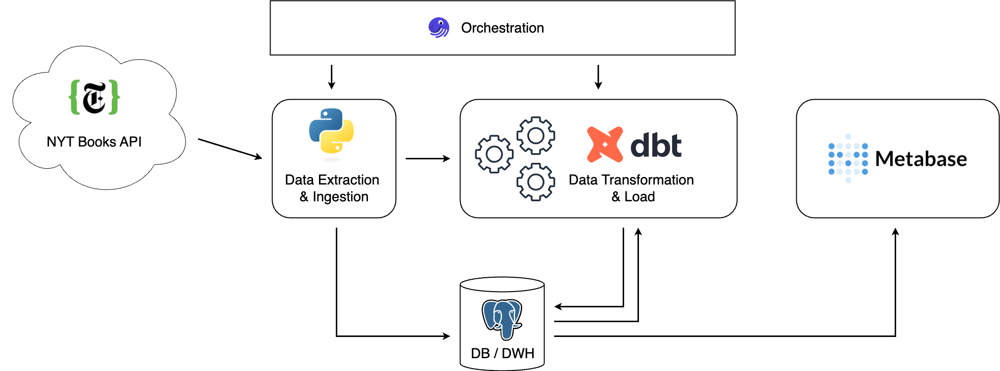

# Project: New York Times best seller books warehouse/analytics


## Overview
Main objective is to practice and showcase my data engineering skills by using modern tools.  
Project is aimed to gather potential insights in evolution of bestseller books across time. Pipeline pulls data on weekly basis.

## Architecture



1. Extract weekly from NYT Books `API`
2. Load data into `Postgresql` data warehouse
3. Transform data using `dbt`
4. Orchestrate and pull data using `Dagster` and `Python`
5. Visualize data using `Metabase` 

## API description
The API gives us the ability to load these lists with their corresponding metadata. Books API has many different endpoints, each proposing a different value (e.g. lists with top 5 books, looking up 1 or more books based on time or/and metadata parameters). 

Every 7 days, on Sunday, NYT composes a lists of best seller books. Each list consists of bestseller books rated from 1 - 15.
Lists have 2 rates of updates:
* Weekly 
* Monthly 

I chose to pull a full overview of lists with full ranking. Therefore we can take a full look onto what books and for how long they reamained on a list in a particular period of time.

Request: GET /lists/full-overview.json

## Pre-requisities

1. git
2. Python >= 3.12.
3. Docker and Docker Compose
4. Postgresql
5. NYT Developers API key

## Installation

1. Request an API key  
Open this link: [https://developer.nytimes.com/get-started](https://developer.nytimes.com/get-started). Follow the instructions and select the Books API when generating the API key. 

2. Create .env file and fill it with the following variables:
```
touch .env
```
```
NYT_API_KEY=<your-api-key>
METABASE_IMAGE=stephaneturquay/metabase-arm64
#METABASE_IMAGE=metabase/metabase

PG_USERNAME=postgres
PG_HOST=localhost
PG_PASSWORD=password
PG_PORT=5432
PG_DBNAME=nyt
```

`Select custom Metabase image if your source machine runs on MacOS.`

3. Set up a data warehouse using Docker Compose

```
docker compose up -d
```  

4. Set up Python virtual environment and download dependencies

```
python3 venv -m myenv
source ./myenv/bin/activate
pip install -r requirments.txt
```

5. Run Dagster
```
cd ./dagster_nyt_books
dagster dev
```
## Run the project
Open dagster UI to check, schedule or run the job:

```
localhost:3000
```

Open metabase to analyze the data:

```
localhost:4000
```

## Future work

- Scheduling
- Testing
- CI/CD
- Deployment


